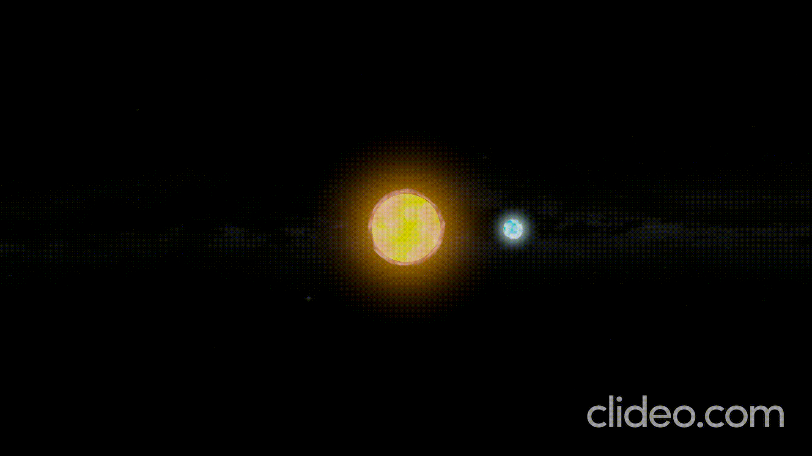

# Gravity Simulation

A Unity-based N-body gravity simulation built with **DOTS (Data-Oriented Technology Stack)** for high-performance physics calculations. This project demonstrates the implementation of Newtonian gravitational dynamics using Unity's modern ECS architecture.

## 📋 Overview

This project serves as an educational implementation of gravitational physics simulations, leveraging Unity DOTS to achieve efficient, scalable entity management and parallel processing capabilities. The simulation models gravitational interactions between multiple celestial bodies using Newton's law of universal gravitation.

## ✨ Features

- **Newtonian Gravity Simulation**: Accurate implementation of gravitational forces between entities
- **DOTS Architecture**: Built entirely with Unity's Entity Component System for maximum performance
- **High Performance**: Utilizes Burst Compiler and Job System for optimized parallel processing
- **Scalable Design**: Capable of simulating large numbers of gravitational bodies efficiently
- **Educational Focus**: Clean, well-structured codebase suitable for learning DOTS concepts

## 🎬 Demo

### Planet with Satellite

*A planet with its orbiting satellite demonstrating stable gravitational interactions*

### Planetary Collision

*Two planets colliding under mutual gravitational attraction*

### Gravitational Deviation

*A planet's trajectory being deflected by gravitational forces*

### Multi-Body Orbiting System

*Multiple planets in stable orbits showcasing N-body dynamics*

## 🛠️ Technical Stack

- **Unity 6 Editor** (Required)
- **Unity DOTS Packages**:
  - Entities
  - Burst Compiler
  - Jobs System
  - Mathematics

## 📦 Requirements

- Unity 6 Editor or later
- Basic understanding of Unity DOTS concepts
- DOTS packages (automatically included via Package Manager)

> ⚠️ **Note**: This project is not compatible with Unity versions prior to Unity 6.

## 🚀 Getting Started

### Installation

1. Clone or download this repository
2. Open the project in Unity 6 Editor
3. Wait for the Unity Editor to import all assets and compile scripts

### Running the Simulation

This project is designed to run within the Unity Editor environment:

1. Open the project in **Unity 6 Editor**
2. Navigate to the main scene in the Scenes folder
3. Press the **Play** button to start the simulation
4. Observe the gravitational interactions between entities in real-time

> **Note**: This project does not include a standalone build configuration. It is intended for development and testing within the Unity Editor only.

## 📚 Learning Objectives

This project demonstrates:

- Implementation of physics-based systems using DOTS
- Efficient data handling with Entity Component System (ECS)
- Performance optimization using Burst Compiler and Job System
- Scalable architecture patterns for real-time simulations
- Best practices for DOTS project structure

## 🎯 Purpose

Created as an educational resource for developers learning Unity DOTS, this project provides a practical example of implementing complex physics simulations using modern Unity architecture. It serves as both a learning tool and a foundation for more advanced gravitational simulations.

## 📄 License

This project is available for educational and personal use.

## 🤝 Contributing

This is primarily an educational project, but suggestions and improvements are welcome. Feel free to fork the repository and experiment with your own implementations.

---

**Built with Unity 6 and DOTS** | *Learning through simulation*
 
